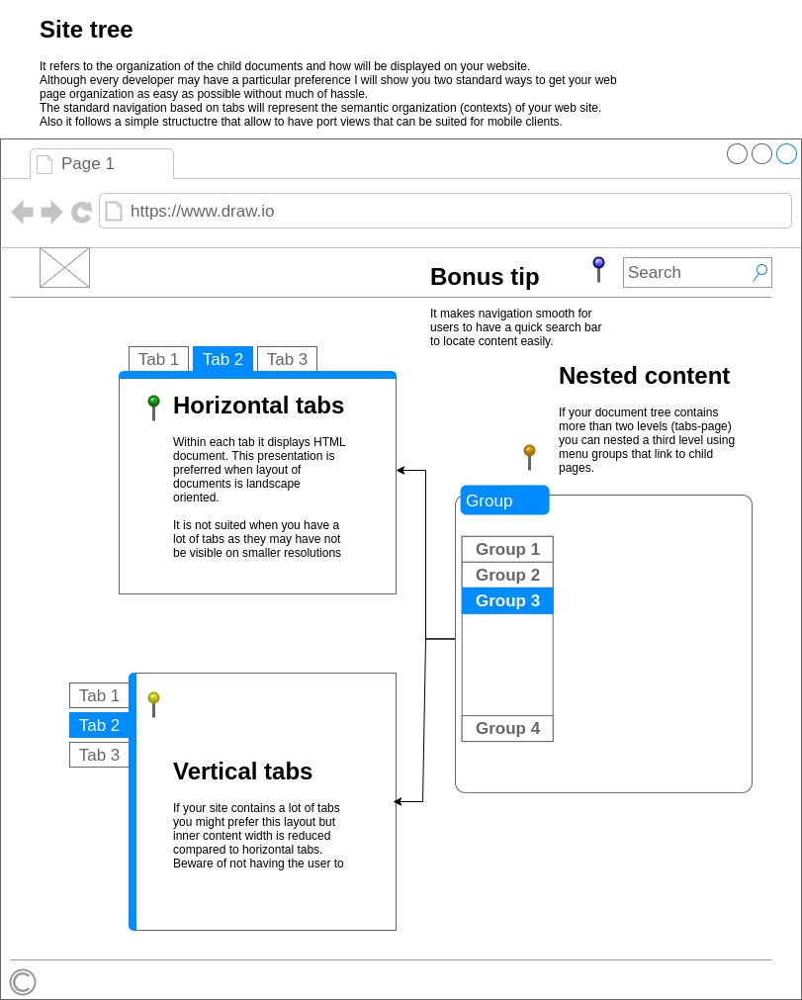

# howto-build-webapp

#### Project foreword 

This project can be considered a quick start guide for new comers that want to build web sites by themselves from the ground up and understand the basics of HTML while practicing without be burden with a lot of design theory.. The topics covered in this project aimed to be simple to follow for experienced and non experienced web developers.

it also an opoortunity for me to share what I learn over a decade crearing web sites from scratch with different methodologies from which I've got a perspective on how the web applications are created and from there I can give my perspective and advising you will see on the following documents I hope they help you to grow professionally as a web developer.

> Jaziel Lopez Experienced Software Engineer
> TJ Area, BC Mexico.

----

### PLAN: BUILD YOUR HTML TEMPLATE

### PLAN: SITE DOCUMENT ORGANIZATION

